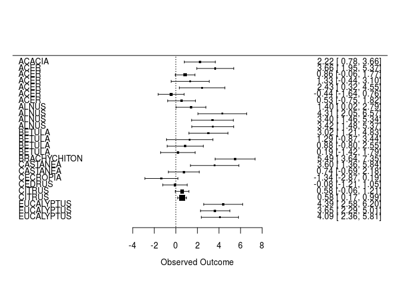
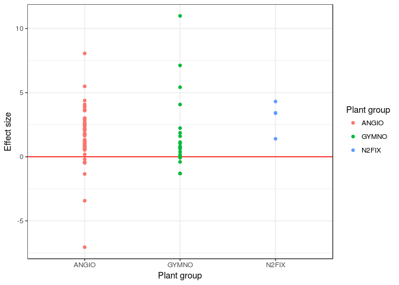

Day 1: Calculating effect sizes
================

Download some data
------------------

For this exercise, we'll be using the Curtis et al. (1999) data set that contains gas exchange observations (i.e. photosynthesis)
of 65 tree species. This data has been extracted from 84 papers and includes mean, standard deviation, coefficient of variation, and number of observations for elevated and ambient levels of C02.

This data set and others are available for downloading from [NCEAS](https://www.nceas.ucsb.edu/meta/publications.html#d_t_t)

``` r
require(gdata,quietly=TRUE)
```

    ## gdata: read.xls support for 'XLS' (Excel 97-2004) files ENABLED.

    ## 

    ## gdata: read.xls support for 'XLSX' (Excel 2007+) files ENABLED.

    ## 
    ## Attaching package: 'gdata'

    ## The following object is masked from 'package:stats':
    ## 
    ##     nobs

    ## The following object is masked from 'package:utils':
    ## 
    ##     object.size

    ## The following object is masked from 'package:base':
    ## 
    ##     startsWith

``` r
curtis<-read.xls("http://www.nceas.ucsb.edu/meta/Curtis/Curtis_CO2_database.xls",as.is=TRUE,verbose=FALSE,sheet=1)

str(curtis)
```

    ## 'data.frame':    784 obs. of  29 variables:
    ##  $ OBSNO   : int  1 2 3 4 5 6 7 8 9 10 ...
    ##  $ PAP_NO  : int  44 44 44 44 44 44 44 44 44 44 ...
    ##  $ PARAM   : chr  "PN" "PN" "AGWT" "AGWT" ...
    ##  $ P_UNIT  : chr  "umolCO2/m2/s" "umolCO2/m2/s" "mg" "mg" ...
    ##  $ GENUS   : chr  "ALNUS" "ALNUS" "ALNUS" "ALNUS" ...
    ##  $ SPECIES : chr  "RUBRA" "RUBRA" "RUBRA" "RUBRA" ...
    ##  $ DIV1    : chr  "WOODY" "WOODY" "WOODY" "WOODY" ...
    ##  $ DIV2    : chr  "N2FIX" "N2FIX" "N2FIX" "N2FIX" ...
    ##  $ AMBC    : num  350 350 350 350 350 350 350 350 350 350 ...
    ##  $ ELEV    : num  650 650 650 650 650 650 650 650 650 650 ...
    ##  $ CO2_UNIT: chr  "ul/l" "ul/l" "ul/l" "ul/l" ...
    ##  $ TIME    : int  46 46 47 47 47 47 47 47 47 47 ...
    ##  $ POT     : chr  "0.5" "0.5" "0.5" "0.5" ...
    ##  $ METHOD  : chr  "GC" "GC" "GC" "GC" ...
    ##  $ STOCK   : chr  "SEED" "SEED" "SEED" "SEED" ...
    ##  $ XTRT    : chr  "FERT" "FERT" "FERT" "FERT" ...
    ##  $ LEVEL   : chr  "HI" "CONTROL" "HI" "CONTROL" ...
    ##  $ QUANT   : chr  "20mgN/l" "." "20mgN/l" "." ...
    ##  $ SOURCE  : chr  "T3" "T3" "T1" "T1" ...
    ##  $ X_AMB   : num  11.8 11.7 2500.5 1460.5 1444.5 ...
    ##  $ SE_AMB  : num  0.64 1.16 324.3 76.6 219.6 ...
    ##  $ SD_AMB  : num  1.43 2.59 725.16 171.28 491.04 ...
    ##  $ CV._AMB : num  12.8 23.3 30.5 12.3 35.7 ...
    ##  $ N_AMB   : int  5 5 5 5 5 5 5 5 5 5 ...
    ##  $ X_ELEV  : num  23.2 25.9 4076.4 1805.3 2740.6 ...
    ##  $ SE_ELEV : num  4.61 1.48 601.7 221.1 525.2 ...
    ##  $ SD_ELEV : num  10.31 3.31 1042.17 494.39 909.67 ...
    ##  $ CV._ELEV: num  46.7 13.4 27.7 28.8 36 ...
    ##  $ N_ELEV  : int  5 5 3 5 3 5 3 5 3 5 ...

Calculate effect sizes
----------------------

For the Curtis data set, the response variables are all measured on a quantitative scale. This allows us the possibility of calculating a number of traditional effect sizes, including Hedge's D and the log-response ratio. In 'metafor' these effect sizes are referred to as 'SMD' and 'ROM', respectively.

In this case, we need the following variables to calculate effect sizes: mean, standard deviation, and sample size.

Additionally, sampling variances can be estimated differently. The default setting (used here) is the 'large-sample approximation' (vtype='LS'). For Hedge's D, one can also estimate 'unbiased estimates' (vtype='UB'); for log-response ratio, 'LS' calculates sampling variance without assuming homoscedasticity while 'HO' assumes that variances are the same in control and treatment groups.

### Hedges' D: Photosynthesis

``` r
require(metafor,quietly = TRUE)
```

    ## Loading 'metafor' package (version 2.0-0). For an overview 
    ## and introduction to the package please type: help(metafor).

``` r
curtis_ES<-escalc(measure='SMD', m1i=X_AMB , sd1i=SD_AMB, n1i=N_AMB, m2i=X_ELEV, sd2i=SD_ELEV, n2i=N_ELEV, vtype='LS',var.names=c("Hedges_D","Hedges_var"),data=curtis)

str(curtis_ES)
```

    ## Classes 'escalc' and 'data.frame':   784 obs. of  31 variables:
    ##  $ OBSNO     : int  1 2 3 4 5 6 7 8 9 10 ...
    ##  $ PAP_NO    : int  44 44 44 44 44 44 44 44 44 44 ...
    ##  $ PARAM     : chr  "PN" "PN" "AGWT" "AGWT" ...
    ##  $ P_UNIT    : chr  "umolCO2/m2/s" "umolCO2/m2/s" "mg" "mg" ...
    ##  $ GENUS     : chr  "ALNUS" "ALNUS" "ALNUS" "ALNUS" ...
    ##  $ SPECIES   : chr  "RUBRA" "RUBRA" "RUBRA" "RUBRA" ...
    ##  $ DIV1      : chr  "WOODY" "WOODY" "WOODY" "WOODY" ...
    ##  $ DIV2      : chr  "N2FIX" "N2FIX" "N2FIX" "N2FIX" ...
    ##  $ AMBC      : num  350 350 350 350 350 350 350 350 350 350 ...
    ##  $ ELEV      : num  650 650 650 650 650 650 650 650 650 650 ...
    ##  $ CO2_UNIT  : chr  "ul/l" "ul/l" "ul/l" "ul/l" ...
    ##  $ TIME      : int  46 46 47 47 47 47 47 47 47 47 ...
    ##  $ POT       : chr  "0.5" "0.5" "0.5" "0.5" ...
    ##  $ METHOD    : chr  "GC" "GC" "GC" "GC" ...
    ##  $ STOCK     : chr  "SEED" "SEED" "SEED" "SEED" ...
    ##  $ XTRT      : chr  "FERT" "FERT" "FERT" "FERT" ...
    ##  $ LEVEL     : chr  "HI" "CONTROL" "HI" "CONTROL" ...
    ##  $ QUANT     : chr  "20mgN/l" "." "20mgN/l" "." ...
    ##  $ SOURCE    : chr  "T3" "T3" "T1" "T1" ...
    ##  $ X_AMB     : num  11.8 11.7 2500.5 1460.5 1444.5 ...
    ##  $ SE_AMB    : num  0.64 1.16 324.3 76.6 219.6 ...
    ##  $ SD_AMB    : num  1.43 2.59 725.16 171.28 491.04 ...
    ##  $ CV._AMB   : num  12.8 23.3 30.5 12.3 35.7 ...
    ##  $ N_AMB     : int  5 5 5 5 5 5 5 5 5 5 ...
    ##  $ X_ELEV    : num  23.2 25.9 4076.4 1805.3 2740.6 ...
    ##  $ SE_ELEV   : num  4.61 1.48 601.7 221.1 525.2 ...
    ##  $ SD_ELEV   : num  10.31 3.31 1042.17 494.39 909.67 ...
    ##  $ CV._ELEV  : num  46.7 13.4 27.7 28.8 36 ...
    ##  $ N_ELEV    : int  5 5 3 5 3 5 3 5 3 5 ...
    ##  $ Hedges_D  : atomic  -1.402 -4.311 -1.622 -0.841 -1.704 ...
    ##   ..- attr(*, "measure")= chr "SMD"
    ##   ..- attr(*, "ni")= int  10 10 8 10 8 10 8 10 8 10 ...
    ##  $ Hedges_var: num  0.498 1.329 0.698 0.435 0.715 ...
    ##  - attr(*, "digits")= num 4
    ##  - attr(*, "yi.names")= chr "Hedges_D"
    ##  - attr(*, "vi.names")= chr "Hedges_var"

Visualize effect sizes (part I) : forest plots
----------------------------------------------

``` r
require(metafor,quietly = TRUE)
require(dplyr,quietly=TRUE)
```

    ## 
    ## Attaching package: 'dplyr'

    ## The following objects are masked from 'package:gdata':
    ## 
    ##     combine, first, last

    ## The following objects are masked from 'package:stats':
    ## 
    ##     filter, lag

    ## The following objects are masked from 'package:base':
    ## 
    ##     intersect, setdiff, setequal, union

``` r
hedges_PN<-filter(curtis_ES, PARAM=="PN")
hedges_PN<-arrange(hedges_PN, GENUS)
forest(hedges_PN$Hedges_D,hedges_PN$Hedges_var, slab=hedges_PN$GENUS, showweights=TRUE)
```



Visualize effect sizes (part II): explore moderators
----------------------------------------------------

``` r
require(metafor,quietly = TRUE)
require(dplyr,quietly=TRUE)
require(ggplot2)
```

    ## Loading required package: ggplot2

``` r
hedges_PN<-filter(curtis_ES, PARAM=="PN")
hedges_PN$SE<-sqrt(hedges_PN$Hedges_var)

dodge <- position_dodge(width=1)

ggplot(hedges_PN, aes(x=DIV2, y=Hedges_D, colour=DIV2)) + 
    #geom_errorbar(aes(ymin=Hedges_D-SE, ymax=Hedges_D+SE), width=.1,position=dodge) +
    geom_point(position=dodge)+ labs(x="Plant group", y="Effect size")+
     guides(fill=FALSE,colour=guide_legend(title="Plant group",title.position = "top"))+
  
  theme_bw()
```



### LRR: water-use efficiency

``` r
require(metafor,quietly = TRUE)

curtis_ES2<-escalc(measure='ROM', m1i=X_AMB , sd1i=SD_AMB, n1i=N_AMB, m2i=X_ELEV, sd2i=SD_ELEV, n2i=N_ELEV, vtype='LS',var.names=c("LRR","LRR_var"),data=curtis)
```

    ## Warning in log(m1i/m2i): NaNs produced

``` r
str(curtis_ES2)
```

    ## Classes 'escalc' and 'data.frame':   784 obs. of  31 variables:
    ##  $ OBSNO   : int  1 2 3 4 5 6 7 8 9 10 ...
    ##  $ PAP_NO  : int  44 44 44 44 44 44 44 44 44 44 ...
    ##  $ PARAM   : chr  "PN" "PN" "AGWT" "AGWT" ...
    ##  $ P_UNIT  : chr  "umolCO2/m2/s" "umolCO2/m2/s" "mg" "mg" ...
    ##  $ GENUS   : chr  "ALNUS" "ALNUS" "ALNUS" "ALNUS" ...
    ##  $ SPECIES : chr  "RUBRA" "RUBRA" "RUBRA" "RUBRA" ...
    ##  $ DIV1    : chr  "WOODY" "WOODY" "WOODY" "WOODY" ...
    ##  $ DIV2    : chr  "N2FIX" "N2FIX" "N2FIX" "N2FIX" ...
    ##  $ AMBC    : num  350 350 350 350 350 350 350 350 350 350 ...
    ##  $ ELEV    : num  650 650 650 650 650 650 650 650 650 650 ...
    ##  $ CO2_UNIT: chr  "ul/l" "ul/l" "ul/l" "ul/l" ...
    ##  $ TIME    : int  46 46 47 47 47 47 47 47 47 47 ...
    ##  $ POT     : chr  "0.5" "0.5" "0.5" "0.5" ...
    ##  $ METHOD  : chr  "GC" "GC" "GC" "GC" ...
    ##  $ STOCK   : chr  "SEED" "SEED" "SEED" "SEED" ...
    ##  $ XTRT    : chr  "FERT" "FERT" "FERT" "FERT" ...
    ##  $ LEVEL   : chr  "HI" "CONTROL" "HI" "CONTROL" ...
    ##  $ QUANT   : chr  "20mgN/l" "." "20mgN/l" "." ...
    ##  $ SOURCE  : chr  "T3" "T3" "T1" "T1" ...
    ##  $ X_AMB   : num  11.8 11.7 2500.5 1460.5 1444.5 ...
    ##  $ SE_AMB  : num  0.64 1.16 324.3 76.6 219.6 ...
    ##  $ SD_AMB  : num  1.43 2.59 725.16 171.28 491.04 ...
    ##  $ CV._AMB : num  12.8 23.3 30.5 12.3 35.7 ...
    ##  $ N_AMB   : int  5 5 5 5 5 5 5 5 5 5 ...
    ##  $ X_ELEV  : num  23.2 25.9 4076.4 1805.3 2740.6 ...
    ##  $ SE_ELEV : num  4.61 1.48 601.7 221.1 525.2 ...
    ##  $ SD_ELEV : num  10.31 3.31 1042.17 494.39 909.67 ...
    ##  $ CV._ELEV: num  46.7 13.4 27.7 28.8 36 ...
    ##  $ N_ELEV  : int  5 5 3 5 3 5 3 5 3 5 ...
    ##  $ LRR     : atomic  -0.679 -0.795 -0.489 -0.212 -0.64 ...
    ##   ..- attr(*, "measure")= chr "ROM"
    ##   ..- attr(*, "ni")= int  10 10 8 10 8 10 8 10 8 10 ...
    ##  $ LRR_var : num  0.0424 0.0131 0.0386 0.0178 0.0598 ...
    ##  - attr(*, "digits")= num 4
    ##  - attr(*, "yi.names")= chr "LRR"
    ##  - attr(*, "vi.names")= chr "LRR_var"

Visualize effect sizes (part I) : forest plots
----------------------------------------------

``` r
require(metafor,quietly = TRUE)
require(dplyr,quietly=TRUE)

LRR_WUE<-filter(curtis_ES2, PARAM=="WUE")
LRR_WUE<-arrange(LRR_WUE, GENUS)

forest(LRR_WUE$LRR,LRR_WUE$LRR_var, slab=LRR_WUE$GENUS, showweights=TRUE)
```


