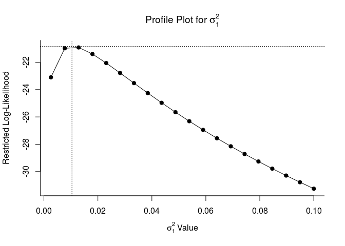
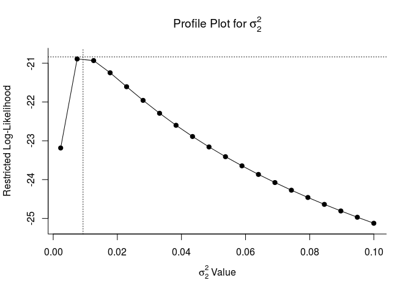
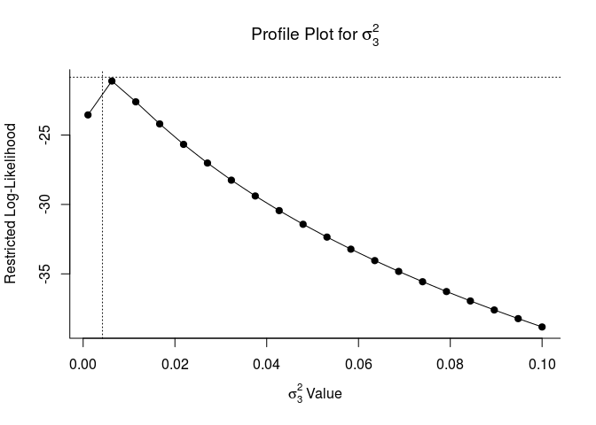
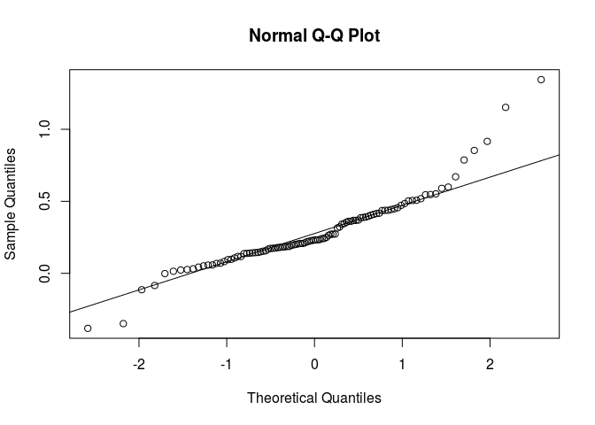
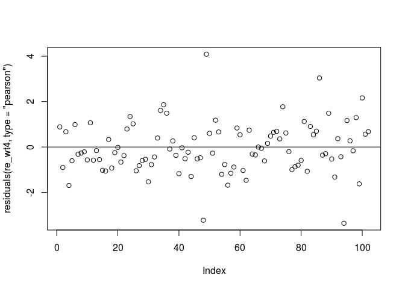
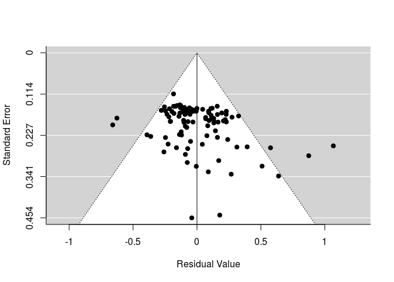
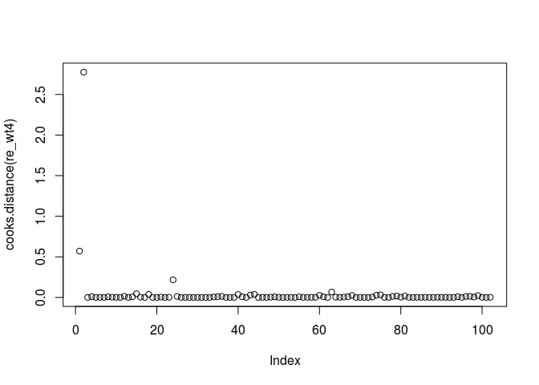

Assumptions, biases, and confounding effects
================

Getting started
---------------

Load packages

    require(gdata)
    require(metafor)
    require(dplyr)
    require(multcomp)
    require(ggplot2)

Download data (Curtis et al. 1999)

``` r
curtis<-read.xls("http://www.nceas.ucsb.edu/meta/Curtis/Curtis_CO2_database.xls",as.is=TRUE,verbose=FALSE,sheet=1)
curtis_ES<-escalc(measure='ROM', m2i=X_AMB , sd2i=SD_AMB, n2i=N_AMB, m1i=X_ELEV, sd1i=SD_ELEV, n1i=N_ELEV, vtype='LS',var.names=c("LRR","LRR_var"),data=curtis)
```

    ## Warning in log(m1i/m2i): NaNs produced

``` r
#summary(as.factor(curtis_ES$PARAM))
curtis_WT<-filter(curtis_ES, PARAM=="TOTWT") # let's use whole plant weight because it has the largest number of observations   

curtis_WT$GEN_SPP<-paste(curtis_WT$GENUS,curtis_WT$SPECIES,sep="_")
```

    ## 
    ## Multivariate Meta-Analysis Model (k = 102; method: REML)
    ## 
    ##   logLik  Deviance       AIC       BIC      AICc  
    ## -20.8378   41.6755   53.6755   69.2463   54.5886  
    ## 
    ## Variance Components: 
    ## 
    ##             estim    sqrt  nlvls  fixed   factor
    ## sigma^2.1  0.0104  0.1019     29     no   PAP_NO
    ## sigma^2.2  0.0093  0.0965      8     no     XTRT
    ## sigma^2.3  0.0042  0.0649     37     no  GEN_SPP
    ## 
    ## Test for Residual Heterogeneity: 
    ## QE(df = 99) = 719.5615, p-val < .0001
    ## 
    ## Test of Moderators (coefficient(s) 2:3): 
    ## QM(df = 2) = 0.0914, p-val = 0.9553
    ## 
    ## Model Results:
    ## 
    ##            estimate      se     zval    pval    ci.lb   ci.ub     
    ## intrcpt      0.2778  0.0501   5.5423  <.0001   0.1796  0.3760  ***
    ## DIV2GYMNO   -0.0044  0.0560  -0.0788  0.9372  -0.1142  0.1054     
    ## DIV2N2FIX    0.0481  0.1687   0.2852  0.7755  -0.2826  0.3788     
    ## 
    ## ---
    ## Signif. codes:  0 '***' 0.001 '**' 0.01 '*' 0.05 '.' 0.1 ' ' 1

Assess model assumptions: homogeneity of variance and normality of residuals
----------------------------------------------------------------------------

**Profile likelihood plots**

These plots let us know if model parameters are 'identifiable'. If they are identifiable, they peak at their estimates. If they are not, they may be flat which indicates that the model does not converge or is overparameterized.

    ## Profiling sigma2 = 1 
    ## 
      |                                                                       
      |                                                                 |   0%
      |                                                                       
      |===                                                              |   5%
      |                                                                       
      |======                                                           |  10%
      |                                                                       
      |==========                                                       |  15%
      |                                                                       
      |=============                                                    |  20%
      |                                                                       
      |================                                                 |  25%
      |                                                                       
      |====================                                             |  30%
      |                                                                       
      |=======================                                          |  35%
      |                                                                       
      |==========================                                       |  40%
      |                                                                       
      |=============================                                    |  45%
      |                                                                       
      |================================                                 |  50%
      |                                                                       
      |====================================                             |  55%
      |                                                                       
      |=======================================                          |  60%
      |                                                                       
      |==========================================                       |  65%
      |                                                                       
      |==============================================                   |  70%
      |                                                                       
      |=================================================                |  75%
      |                                                                       
      |====================================================             |  80%
      |                                                                       
      |=======================================================          |  85%
      |                                                                       
      |==========================================================       |  90%
      |                                                                       
      |==============================================================   |  95%
      |                                                                       
      |=================================================================| 100%



    ## Profiling sigma2 = 2 
    ## 
      |                                                                       
      |                                                                 |   0%
      |                                                                       
      |===                                                              |   5%
      |                                                                       
      |======                                                           |  10%
      |                                                                       
      |==========                                                       |  15%
      |                                                                       
      |=============                                                    |  20%
      |                                                                       
      |================                                                 |  25%
      |                                                                       
      |====================                                             |  30%
      |                                                                       
      |=======================                                          |  35%
      |                                                                       
      |==========================                                       |  40%
      |                                                                       
      |=============================                                    |  45%
      |                                                                       
      |================================                                 |  50%
      |                                                                       
      |====================================                             |  55%
      |                                                                       
      |=======================================                          |  60%
      |                                                                       
      |==========================================                       |  65%
      |                                                                       
      |==============================================                   |  70%
      |                                                                       
      |=================================================                |  75%
      |                                                                       
      |====================================================             |  80%
      |                                                                       
      |=======================================================          |  85%
      |                                                                       
      |==========================================================       |  90%
      |                                                                       
      |==============================================================   |  95%
      |                                                                       
      |=================================================================| 100%



    ## Profiling sigma2 = 3 
    ## 
      |                                                                       
      |                                                                 |   0%
      |                                                                       
      |===                                                              |   5%
      |                                                                       
      |======                                                           |  10%
      |                                                                       
      |==========                                                       |  15%
      |                                                                       
      |=============                                                    |  20%
      |                                                                       
      |================                                                 |  25%
      |                                                                       
      |====================                                             |  30%
      |                                                                       
      |=======================                                          |  35%
      |                                                                       
      |==========================                                       |  40%
      |                                                                       
      |=============================                                    |  45%
      |                                                                       
      |================================                                 |  50%
      |                                                                       
      |====================================                             |  55%
      |                                                                       
      |=======================================                          |  60%
      |                                                                       
      |==========================================                       |  65%
      |                                                                       
      |==============================================                   |  70%
      |                                                                       
      |=================================================                |  75%
      |                                                                       
      |====================================================             |  80%
      |                                                                       
      |=======================================================          |  85%
      |                                                                       
      |==========================================================       |  90%
      |                                                                       
      |==============================================================   |  95%
      |                                                                       
      |=================================================================| 100%



**Quantile-Quantile plots**

``` r
qqnorm(curtis_WT$LRR)
qqline(curtis_WT$LRR)
```



**Model residuals**

*Residuals vs. fitted*

``` r
plot(fitted(re_wt4), rstandard(re_wt4)$z)
abline(h =0)
```


*Pearson model residuals*

``` r
plot(residuals(re_wt4, type="pearson"))
abline(h =0)
```



Publication bias
----------------

**Funnel plot**

``` r
funnel(re_wt4)
```



**Egger's regression**

Egger's regression tests for funnel plot asymmetry. One can use a number of moderators; the most common are the inverse of sampling variance or standard errors.

    ```r
       test.egger = rma.mv(LRR,LRR_var, mod = LRR_var, random=list(~1|PAP_NO, ~1|XTRT, ~1|GEN_SPP), data = curtis_WT)  
       
    summary(test.egger)
    ```

    ```
    ## 
    ## Multivariate Meta-Analysis Model (k = 102; method: REML)
    ## 
    ##   logLik  Deviance       AIC       BIC      AICc  
    ## -18.1427   36.2853   46.2853   59.3112   46.9236  
    ## 
    ## Variance Components: 
    ## 
    ##             estim    sqrt  nlvls  fixed   factor
    ## sigma^2.1  0.0102  0.1009     29     no   PAP_NO
    ## sigma^2.2  0.0074  0.0861      8     no     XTRT
    ## sigma^2.3  0.0033  0.0579     37     no  GEN_SPP
    ## 
    ## Test for Residual Heterogeneity: 
    ## QE(df = 100) = 740.2733, p-val < .0001
    ## 
    ## Test of Moderators (coefficient(s) 2): 
    ## QM(df = 1) = 4.0127, p-val = 0.0452
    ## 
    ## Model Results:
    ## 
    ##          estimate      se    zval    pval   ci.lb   ci.ub     
    ## intrcpt    0.2534  0.0445  5.6963  <.0001  0.1662  0.3406  ***
    ## mods       1.9360  0.9665  2.0032  0.0452  0.0418  3.8303    *
    ## 
    ## ---
    ## Signif. codes:  0 '***' 0.001 '**' 0.01 '*' 0.05 '.' 0.1 ' ' 1
    ```

*Note that there is a function in metafor ('regtest') for more simple models.*

**Cook's distance**

This plot helps you find outliers and influential points.

    ```r
      cd<-cooks.distance(re_wt4)
       plot(cd)
    ```

    
