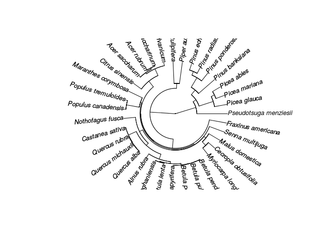

Build a phylogeny
================

*Load packages*

    require(gdata)
    require(metafor)
    require(dplyr)
    require(pez)
    require(phytools)
    require(ape)

    ## Warning in log(m1i/m2i): NaNs produced

**Clean species names**

Species names are taxonomically resolved using [The Plant List](http://www.theplantlist.org/)

``` r
setwd('/homes/dc78cahe/Dropbox (iDiv)/Teaching/MetaAnalysis_Course/pages/Day4_files/')
curtis_WT$GENUS<-tolower(as.character(curtis_WT$GENUS))
curtis_WT$GENUS<-paste(toupper(substr(curtis_WT$GENUS, 1, 1)), substr(curtis_WT$GENUS, 2, nchar(curtis_WT$GENUS)), sep="")

curtis_WT$SPECIES<-tolower(as.character(curtis_WT$SPECIES))
curtis_WT$GEN_SPP2<-as.character(paste(curtis_WT$GENUS, curtis_WT$SPECIES,sep=" "))

curtis_WT$GEN_SPP2<-ifelse(curtis_WT$GEN_SPP2=="Populusx euramericana","Populus × euramericana",curtis_WT$GEN_SPP2)

spp<-unique(as.character(curtis_WT$GEN_SPP2))

spp2 <- TPL(spp, corr = TRUE, repeats=10) # repeats allows you to re-connect to the TPL server

spp2$new_species<-paste(spp2$New.Genus, spp2$New.Species,sep="_")

length(unique(spp2$new_species)) #number of unique species identified via TPL
```

    ## [1] 36

``` r
length(spp) #number of unique species according to the data set
```

    ## [1] 37

``` r
write.csv(spp2,"TPL_sppnames.csv",row.names=F)
```

Build phylogeny using an [updated version](https://academic.oup.com/jpe/article/9/2/233/2928108/An-updated-megaphylogeny-of-plants-a-tool-for) of the Zanne et al. [2013](http://datadryad.org/resource/doi:10.5061/dryad.63q27)

``` r
setwd('/homes/dc78cahe/Dropbox (iDiv)/Teaching/MetaAnalysis_Course/pages/Day4_files/')
phy<-read.tree("PhytoPhylo.tre")

local_tree <- congeneric.merge(phy,spp2$new_species,split="_")
```

    ## 
    ## Number of species in tree before: 32
    ## Number of species in tree now:    36

``` r
local_tree <- drop.tip(local_tree, setdiff(local_tree$tip.label, spp2$new_species))

length(unique(local_tree$tip.label))
```

    ## [1] 35

``` r
plot(local_tree, type="fan",cex=0.8)
```



``` r
write.tree(local_tree, "Curtis_phylogeny.tre")
```

Note that the pruned phylogeny has 35 unique species.
